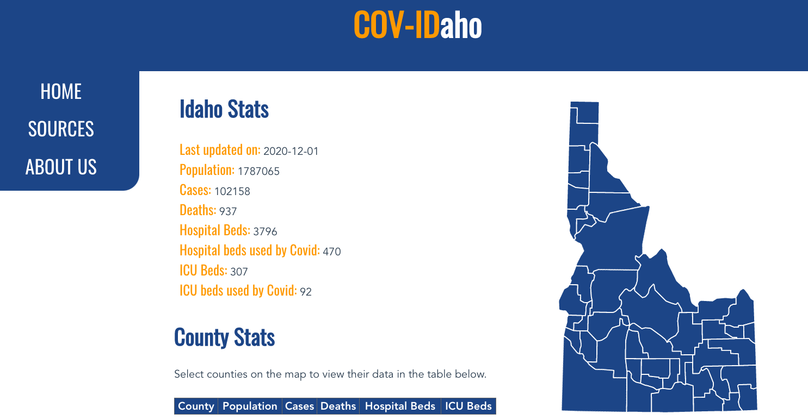
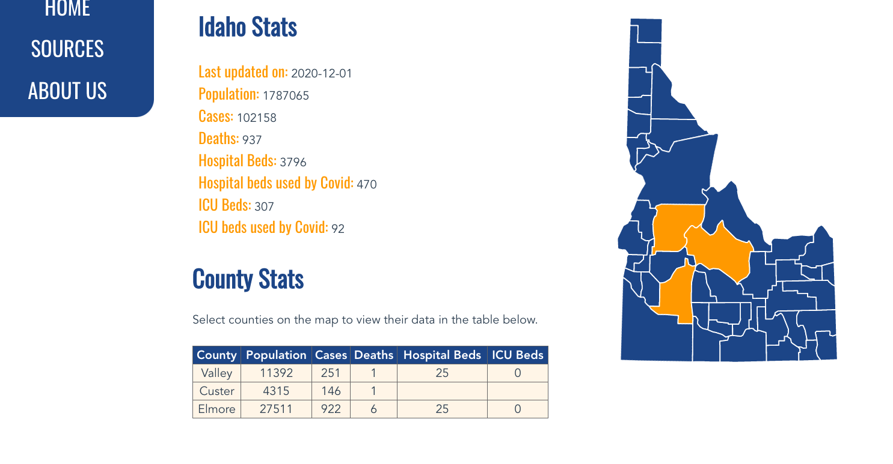
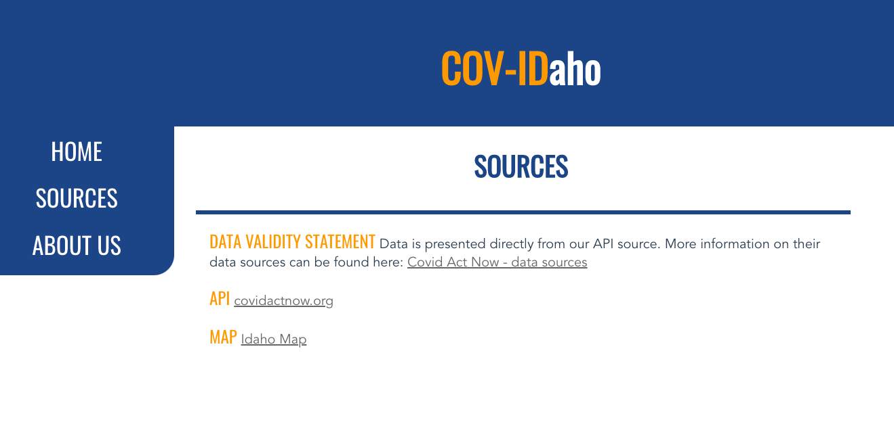
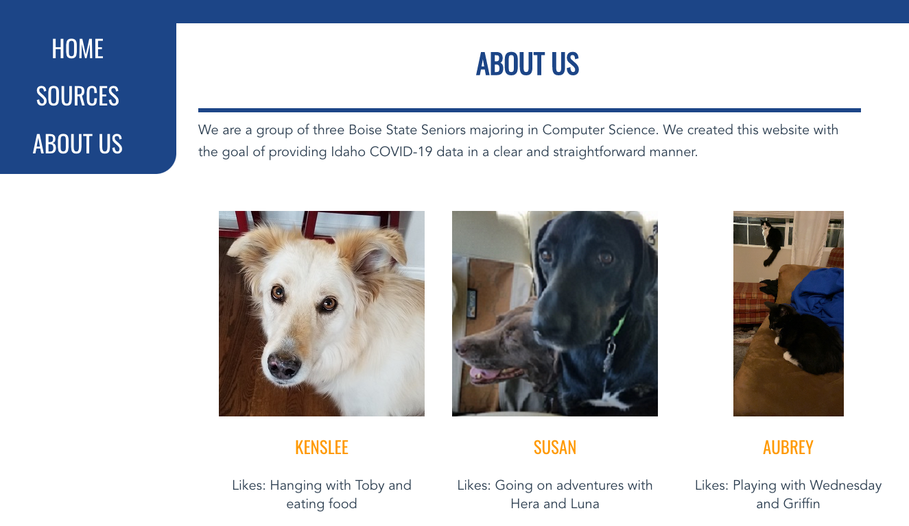

# COV-IDaho Web Application
### Authors: Aubrey Spannagel, Susan Higginbotham, Kenslee Moy

## Overview
This web application provides Idaho COVID-19 data at the state and county level. Our website can be viewed here: [COV-IDaho](https://cov-idaho.herokuapp.com/).  
To watch a video walkthrough of the website, go here: . 

## Technologies Used
* VueJS
* NodeJS
* HTML
* CSS
* Heroku Hosting/Continuous Deployment
* Git version control
* GitHub git visualizion 

## Main page
At the state level, statistics provided include population, number of cases, number of deaths, total number of  hospital beds, hospital beds used by COVID patients, total number of ICU beds, and ICU beds used by COVID patients.  At the county level, the number of hospital or ICU beds used by COVID patients is not typically available, so these statistics are not included. 

The map is interactive; clicking on a county will pull up county stats in the table. Deselecting a county will remove it from the table. 

## Sources
The Sources page provides links to the API source, their data sources, and the svg map utilized on the home page.

## About Us
The About Us page offers information about the creators of this web app and their motivations for creating it. 

## Development Overview
We worked as a team and followed Agile techniques, meeting at least once a week to coordinate and troubleshoot any issues that arose. This also kept us on track to meet given deadlines. We split up the work into 3 main parts: UI, API calls, and features. This allowed us to work fairly independently to provide a finished product in a reasonable amount of time.
